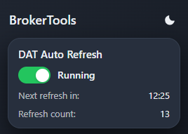
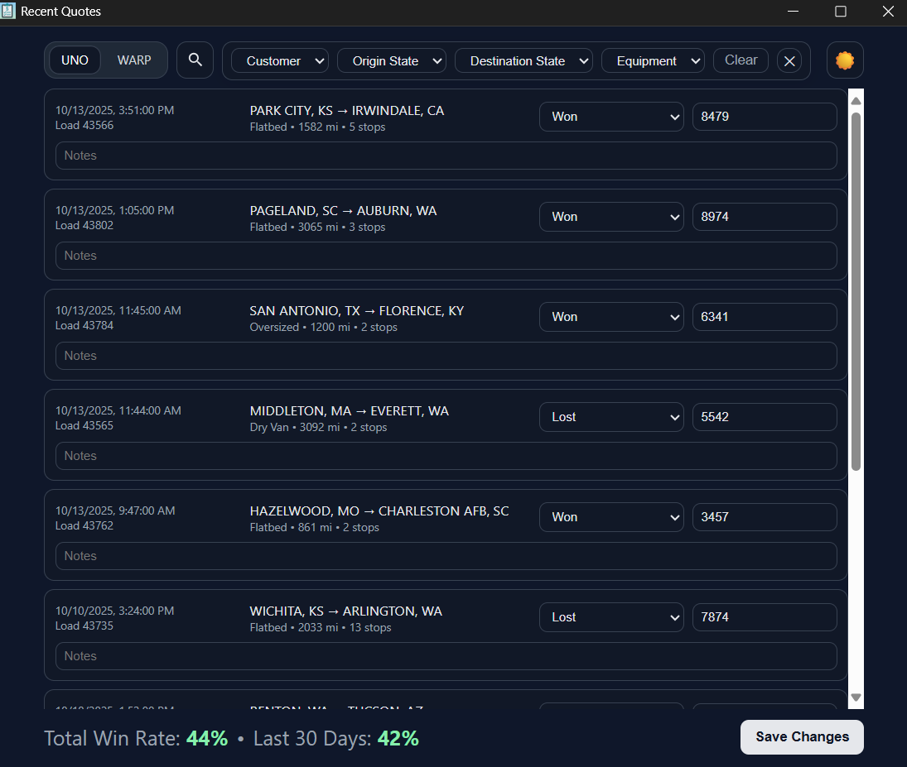
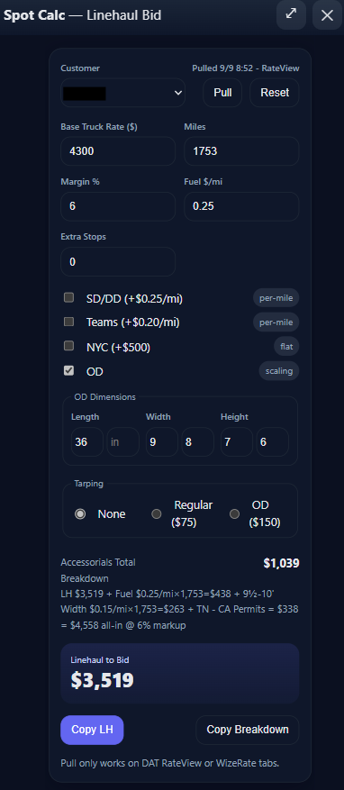

# BrokerTools Portfolio

I build automation and analytics tools that make brokerages more efficient and less chaotic.

Everything here started as a real-world problem on the floor — slow quoting, stale load posts, replying to hundreds of carrier emails — and turned into working solutions I coded myself.

This repo showcases those projects with short summaries, screenshots, and demos, plus deeper breakdowns for anyone who wants to see what’s happening behind the scenes.

---

## 🚛 DAT Auto Refresh

**Problem:** Brokers manually refreshed DAT Loadboard posts every 15 minutes, wasting time if loads weren't refreshed or tanking visibility.  
**Solution:** Built a Chrome/Edge extension that detects aging posts and auto-refreshes them using DAT’s own API.  
**Impact:** Kept brokers’ loads visible and competitive by automatically refreshing posts before they expired — no more missed trucks due to stale listings.

[▶️ Watch high-def demo (MP4)](assets/dat-auto-refresh-demo.mp4)

Features include:
- Smart refresh timing  
- Retry/recovery logic  
- Clean modern popup with dark mode toggle  
- Full background operation (even when the DAT tab is hidden)

**Tech:** JavaScript (MV3), Chrome Extensions API, async messaging, HTML/CSS UI  

🧩 [Read full project details →](projects/dat-auto-refresh/README.md)

---

## 🧾 Quote Logger

**Problem:** Quoting across customer spot portals is slow, messy, and hard to track historically. Manual spreadsheets drift, and win-rate visibility is nearly impossible in real time.  
**Solution:** A Chrome/Edge extension that scrapes the active spot portal page, normalizes each quote (origin/dest, equip, miles, stops, rate, status, dates), and syncs it to a central Quote Log via an API endpoint.  
**Impact:** Centralized, clean quote history with quick edits and live win-rate snapshots, plus a dedicated **Recents** page for searching past quotes and updating status/rate/notes in bulk.

Features include:
- One-click quote capture from the current customer portal tab  
- Robust field parsing & normalization (dates, numbers, equipment)  
- De-dupe by Load ID before syncing  
- **Recents** view: search by Customer, Origin State, Destination State, Equipment; edit status, rate, notes; see total and 30-day win-rate  
- Clean, modern UI with light/dark mode and team/employee sliders  
- Desktop notification after sync

**Tech:** JavaScript (MV3), Chrome Extensions API, injected page scripts, HTML/CSS UI  

🧩 [Read full project details →](projects/quote-logger/README.md)

---

## 💰 Spot Calc

**Problem:** Some customers require linehaul-only bids with accessorial charges and fuel added later. Brokers manually converted DAT “Truck Pay” (market all-in rate) into linehaul-only bids for each customer, using inconsistent spreadsheets and formulas.  
**Solution:** A Chrome/Edge extension that auto-pulls Base & Miles from DAT RateView or WizeRate and applies customer-specific accessorial templates — instantly converting the market rate into a precise linehaul-only bid.  
**Impact:** Eliminated manual math and miscalculations, standardizing quote logic across the floor.

Features include:
- One-click **Pull** from DAT RateView / WizeRate  
- Configurable **customer pricing templates** (fuel $/mi, accessorial charges, OD pricing)  
- Automatic **OD scaling, permit fees, stops, and tarping logic**  
- Smart **copy buttons** for Linehaul $ or full breakdown  
- Clean, modern overlay UI — draggable, resizable, dark/light adaptive  
- Buttons can be **injected into any customer portal** to launch the calculator pre-filled with lane data  

**Tech:** JavaScript (MV3), Chrome Extensions API, HTML/CSS UI, async messaging  

🧩 [Read full project details →](projects/spot-calc/README.md)

---

## 📦 BrokerTools – Load Posts Suite

**Problem:** Load posting and carrier replies eat up hours every day. Brokers manually retype load details into DAT, juggle Excel sheets, and copy/paste the same info across dozens of emails — a slow, error-prone mess.  
**Solution:** A complete Excel + Outlook VBA automation suite that centralizes load data, automates DAT load postings, and powers instant Smart Replies straight from Outlook — no retyping, no searching, no wasted motion.  
**Impact:** Transformed the posting and covering process from hours to minutes and made carrier replies near-instant, allowing one broker to handle the volume of an entire team.

**Features include:**
- **Bulk DAT Upload:** Post all of your freight to DAT in seconds  
- **Smart Bulk Reply Engine:** Match and reply to hundreds of carrier emails automatically  
- **SmartBot:** Auto-responds to carriers even when away from the desk  
- **Load Wizard & TMS Import:** Create new loads or batch import all loads from your TMS system in seconds  
- **Master Sheet Automation:** One-click actions for Copy, Hide, Delete, and cleanup  
- **Clipboard Tools:** Instant load summaries for messages or chats  

**Tech:** VBA (Excel + Outlook), COM automation bridge, MSForms, RegEx, Windows Registry persistence  

🧩 [Read full project details →](projects/load-posts-suite/README.md)

---

### ⚠️ Disclaimer

All tools and code shown here were independently developed and are the sole property of the author.  
No proprietary or confidential data from any employer is included.
