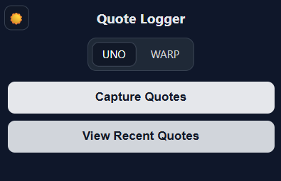

# BrokerTools Portfolio

I build automation and analytics tools that make brokerages more efficient and less chaotic.

Everything here started as a real-world problem on the floor — slow quoting, stale load posts, replying to hundreds of carrier emails — and turned into working solutions I coded myself.

This repo showcases those projects with short summaries, screenshots, and demos, plus deeper breakdowns for anyone who wants to see what’s happening behind the scenes.

## 🚛 DAT Auto Refresh

[▶️ Watch high-def demo (MP4)](assets/dat-auto-refresh-demo.mp4)

**Problem:** Brokers manually refreshed DAT Loadboard posts every 15 minutes, wasting time if loads weren't refreshed or tanking visibility.  
**Solution:** Built a Chrome/Edge extension that detects aging posts and auto-refreshes them using DAT’s own API.  
**Impact:** Kept brokers’ loads visible and competitive by automatically refreshing posts before they expired — no more missed trucks due to stale listings.

Features include:
- Smart refresh timing  
- Retry/recovery logic  
- Clean modern popup with dark mode toggle  
- Full background operation (even when the DAT tab is hidden)

**Tech:** JavaScript (MV3), Chrome Extensions API, async messaging, HTML/CSS UI  

🧩 [Read full project details →](projects/dat-auto-refresh/README.md)

## 🧾 Quote Logger

  

**Problem:** Quoting across customer spot portals is slow, messy, and hard to track historically. Manual spreadsheets drift, and win-rate visibility is nearly impossible in real time.  
**Solution:** A Chrome/Edge extension that scrapes the active spot portal page, normalizes each quote (origin/dest, equip, miles, stops, rate, status, dates), and syncs it to a central Quote Log via an API endpoint.  
**Impact:** Centralized, clean quote history with quick edits and live win-rate snapshots, plus a dedicated **Recents** page for searching past quotes and updating status/rate/notes in bulk.

Features include:
- One-click quote capture from the current customer portal tab  
- Robust field parsing & normalization (dates, numbers, equipment)  
- De-dupe by Load ID before syncing  
- **Recents** view: search by Customer, Origin State, Destination State, Equipment; edit status, rate, notes; see total and 30-day win-rate  
- Clean, modern UI with light/dark mode and team/employee sliders 
- Desktop notification after sync

**Tech:** JavaScript (MV3), Chrome Extensions API, injected page scripts, HTML/CSS UI  

🧩 [Read full project details →](projects/quote-logger/README.md)

### ⚠️ Disclaimer

All tools and code shown here were independently developed and are the sole property of the author.  
No proprietary or confidential data from any employer is included.
