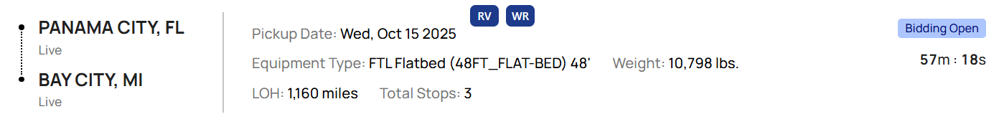

# Spot Calc – Linehaul Bid Calculator Extension

Spot Calc converts DAT RateView or WizeRate “Truck Pay” (market all-in) into a **linehaul-only bid** using configurable, customer-specific accessorial templates.

---

### 🚀 Overview

Brokers often rely on RateView’s all-in truck pay but must strip out fuel and accessorials to arrive at a true **linehaul bid**.  
Spot Calc automates that conversion with a clean calculator overlay that pulls real-time Base & Miles from DAT RateView or WizeRate, then applies the correct customer markup and charge logic.

---

### 🧩 Problem

Manually breaking down DAT RateView’s “Truck Pay” into a customer-specific linehaul was slow, error-prone, and inconsistent.  
Each customer required different markup, fuel rate, and accessorial math — and most brokers used personal spreadsheets with outdated formulas.

---

### ⚙️ Solution

Spot Calc injects small **RV / WR** buttons directly into any customer portal or load board.  
Clicking one automatically gathers all available lane details (origin/dest, equipment, weight, length, width, height, miles) and opens the calculator overlay.

Inside the calculator:

- **Pull Base & Miles** directly from DAT RateView or WizeRate  
- **Automatically selects correct customer template** from the dropdown (each defines margin %, fuel $/mi, and accessorial charge logic)  
- Toggle accessorials like **SD/DD, Teams, NYC, OD, Tarping, Extra Stops**  
- Automatically calculate **OD scaling, permit fees, and per-mile surcharges**  
- Instantly view **linehaul bid, accessorial total, and a detailed breakdown**  
- Copy just the **linehaul $** or the **entire breakdown** with one click  

The overlay is draggable, resizable, remembers position between sessions, and can run entirely in-page — no separate window required.

---

### 🧠 Key Features

- 🔄 Auto-pull Base & Miles from RateView or WizeRate  
- 🧾 Configurable pricing templates for **any customer**  
- 📏 Dynamic OD dimension scaling with permit lookup  
- 🛠  Accessorial toggles for SD/DD, Teams, NYC, Tarping, Stops, etc.  
- 📋 One-click copy for **Linehaul** or **Breakdown**  
- 🪟 Persistent draggable/resizable overlay UI  
- 🌗 Adaptive styling for light/dark modes  
- 🔌 Buttons can be injected into **any customer portal** to launch Spot Calc pre-filled with lane data  

---

### 🧠 Tech Stack

- **JavaScript (MV3)** – background + content scripts + popup logic  
- **Chrome Extensions API** – messaging, storage, scripting, notifications  
- **HTML / CSS** – Tailwind-style custom dark/light UI  
- **Async messaging** between portal page, RateView/WizeRate, and overlay  
- **Local storage** (chrome.storage.sync) for template persistence and overlay geometry  

---

### 🏁 Impact

Spot Calc standardized pricing logic across customers and eliminated manual quote math.  
It enables brokers to pull, calculate, and copy bids in seconds — keeping quotes fast, consistent, and data-driven.

---

### ⚠️ Disclaimer

All tools and code shown here were independently developed and are the sole property of the author.  
No proprietary or confidential data from any employer is included.